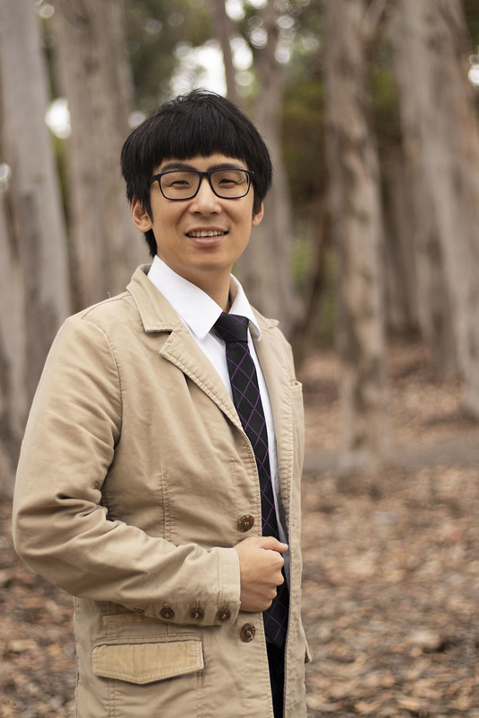

--- 
layout: page 
title : Yi-Zhuang You 尤亦庄 (He/Him)
permalink: /people/YZYou
hide: true
feature-img: "assets/img/figures/LGBT-min.png"
redirect_from:
  - /YZYou/
  - /YZYou
---

You can find a printable (and longer) version of my CV [here]({{site.baseurl}}/assets/pdf/CV.pdf){:target="_blank"}.

----

<figure style="float: right; max-width: 33%;">
  
  <figcaption style="text-align: right; color: gray; font-size: 80%">Credit: <a href="https://www.flickr.com/photos/160961487@N08/albums" target="blank">UCSD Division of Physical Sciences</a></figcaption>
</figure>

### Contact Information

- **Email**: yzyou@physics.ucsd.edu
- **Phone**: +1(858)822-4462 (Office)
- **Office**: Mayer Hall 5202
- **Affiliation**:  
  Department of Physics, University of California, San Diego, San Diego, CA 92093, USA
- **GitHub**: [Everett You](https://github.com/EverettYou){:target="_blank"}
- **StackExchange**: [Everett You](https://physics.stackexchange.com/users/7616/everett-you){:target="_blank"}
- **ORCiD**: [0000-0003-4080-5340](https://orcid.org/0000-0003-4080-5340){:target="_blank"}
- **Google Scholar**: [Yi-Zhuang You (尤亦庄)](https://scholar.google.com/citations?hl=en&user=PLFbeHMAAAAJ){:target="_blank"}

### Research Interests

Theoretical investigation on correlated topological phases and phase transitions in condensed matter and high-energy physics, understanding dynamics of quantum entanglement, and application of machine learning in many-body problems.

### Professional Appointments

- Associate Professor, University of California, San Diego (2024 - present)

- Assistant Professor, University of California, San Diego (2018 - 2024)

### Academic Background

- B.Sc. Physics, Nanjing University (2004 - 2008)

- Ph.D. Physics, Tsinghua University (2008 - 2013)

- Postdoc, University of California, Santa Barbara (2013 - 2016)

- Postdoc, Harvard University (2016 - 2018)

### Awards and Honors

- National Science Foundation, CAREER award (2022)
- University of California Hellman Fellow (2021)  
- National Scholarship for Graduate Students –China (2012)
- Graduate Scholarship –Tsinghua University (2010) 
- C.N. Yang Fellowship –Tsinghua University (2009)
- Honor Graduate –Nanjing University (2008)

### Publications

#### Selected Articles

1. Chao-Ming Jian, Yi-Zhuang You, Romain Vasseur, Andreas W. W. Ludwig. *Measurement-induced criticality in random quantum circuits*. Physical Review B **101**(10), 104302 (2020). [arXiv:1908.08051](https://arxiv.org/abs/1908.08051){:target="_blank"}

2. Yi-Zhuang You, Ashvin Vishwanath. *Superconductivity from valley fluctuations and approximate SO(4) symmetry in a weak coupling theory of twisted bilayer graphene*. npj Quantum Materials **4**(1), 16 (2019). [arXiv:1805.06867](https://arxiv.org/abs/1805.06867){:target="_blank"}

3. Yi-Zhuang You, Zhao Yang, Xiao-Liang Qi. *Machine learning spatial geometry from entanglement features*. Physical Review B **97**(4), 045153 (2018). [arXiv:1709.01223](https://arxiv.org/abs/1709.01223){:target="_blank"}

4. Yi-Zhuang You, Andreas W. Ludwig, Cenke Xu. *Sachdev-Ye-Kitaev model and thermalization on the boundary of many-body localized fermionic symmetry protected topological states*. Physical Review B **95**(16), 115150 (2017). [arXiv:1602.06964](https://arxiv.org/abs/1602.06964){:target="_blank"}

5. Yi-Zhuang You, Cenke Xu. *Interacting topological insulator and emergent grand unification theory*. Physical Review B **91**, 125147 (2015). [arXiv:1412.4784](https://arxiv.org/abs/1412.4784){:target="_blank"}

#### Book Chapters

1. Yi-Zhuang You, Zheng-Yu Weng. *Coexisting Itinerant and Localized Electrons*. In: Iron-Based Superconductivity, P. D. Johnson ed., Springer International Publishing, Springer Series in Material Science 211, Chap. 10, p. 377-408 (2015). [arXiv:1311.4094](https://arxiv.org/abs/1311.4094){:target="_blank"}

### Selected Invited Talks

- Emergent classicality of information bottleneck. Perimeter Institute (2023). ([video](https://pirsa.org/23060044){:target="_blank"})
- Machine learning physics: from quantum mechanics to holographic geometry. Perimeter Institute (2019). ([video](https://pirsa.org/19070014){:target="_blank"})
- Entanglement features of random Hamiltonian dynamics. Kavli Institute for Theoretical Physics (2018). ([video](https://online.kitp.ucsb.edu/online/dynq-c18/you/){:target="_blank"})

### Services

- UCSD Chancellor’s Advisory Committee on Gender Identity and Sexual Orientation Issues ([GISOI](https://gisoi.ucsd.edu/about/index.html){:target="_blank"}) (2023 - present) 
- Editorial Board Member for Machine Learning: Science and Technology (2019 - present)
- Referee for journals including Nature Physics, Physical Review Letters, Physical Review X, Physical Review B, etc.

### Teaching Experience

- Quantum Mechanics, UCSD (2018-2025)
- Statistical Mechanics, UCSD (2024)
- Condensed Matter Physics, UCSD (2022-2023)
